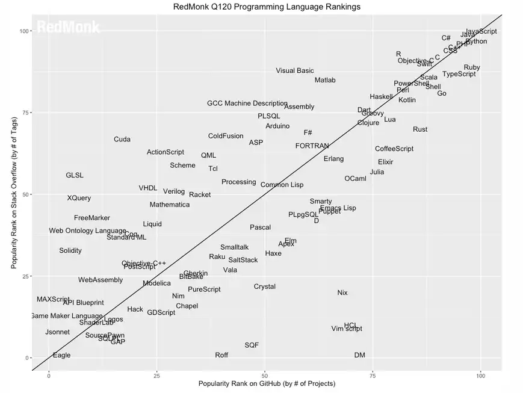
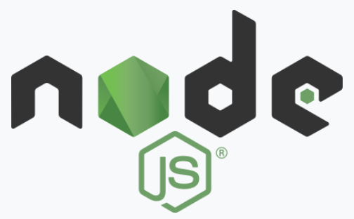
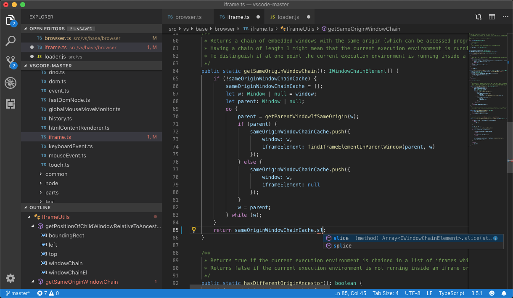
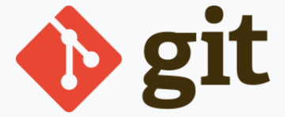

## CyberArk Data Tool

Entwicklung einer cross-Plattform GUI mit Web Technologien

<small>von [Achim Hilker](https://github.com/achimwork) / [PRO DV AG](https://prodv.de)</small>

<aside class="notes">
reveal.js 
umfangreich 
feedback 
fragen 
</aside>

---

## Übersicht

1. Hintergrund
2. Anforderungen
3. Technologische Auswahl
4. Demo: Entwicklungsumgebung
5. Demo: Das Ergebnis
6. Zusammenfassung

<aside class="notes">
</aside>

---

### Hintergrund

--

### Problem

{style="max-height:50vh;"}

<aside class="notes">
- REWE 
- Bulk import über PVWA 
- PAS Exporter -> CSV 
</aside>

--

### Lösung

{style="max-height:50vh;"}

<aside class="notes">
</aside>

---

### Anforderungen

--

### Anwender

- intuitive Oberfläche{.fragment}

- intuitive Bedienung{.fragment}

- Hilfetexte{.fragment}

--

### Administrator

- anpassbar{.fragment}

- konfigurierbar{.fragment}

- Eingabevalidierung{.fragment}

--

### Entwickler

- Dokumentation{.fragment}

- Entwicklungsumgebung{.fragment}

- Automatisiert{.fragment}

--

### Technologisch

- zukunftssichere Technologien{.fragment}

- Plattformübergreifend{.fragment}

- Open Source{.fragment}

- möglichst generisch{.fragment}

--

### Datenquellen

- CSV Datei PAS Exporter{.fragment}

- Benutzereingaben{.fragment}

--

<!-- ### Inhaltlich -->

::: block
JSON Schema
:::

{style="max-height:50vh;"}

---

## technologische Auswahl

--

### Programmiersprachen

{ height=70px style="padding:5px;"}
::: block
HTML5
:::

{ height=70px style="padding:5px;"}
::: block
CSS3
:::

{ height=70px style="padding:5px;"}
::: block
JavaScript
:::

<aside class="notes">
- zunächst Powershell
</aside>

--

### Rangliste Programmiersprachen

{style="max-height:50vh;"}

--

### Bibliotheken

- [node.js](https://nodejs.org/)

- [electron.js](https://www.electronjs.org/)

- [formio.js](https://formio.github.io/formio.js/)

- [Semantic UI](https://semantic-ui.com/)

--

{ width=100px style="padding:5px;"}

### [node.js](https://nodejs.org/)

- asynchrone, event getriebene, JavaScript Laufzeitumgebung {.fragment}

- "Serverseitiges JavaScript"{.fragment}

- Open Source{.fragment}

- OpenJS Foundation{.fragment}

--

{ width=100px style="padding:5px;"}

### [electron.js](https://www.electronjs.org/)

- Webapplikationen für den Desktop{.fragment}

- OpenJS Foundation{.fragment}

- von vielen Open Source Projekten genutzt{.fragment}

{.fragment}

--

{ height=50px style="padding:5px;"}

### [formio.js](https://formio.github.io/formio.js/)

- Form und Datamanagement Plattform{.fragment}

- Form-Viewer und Form-Editor{.fragment}

- Validierung{.fragment}

- Konfiguration als Standardisierte JSON Datei{.fragment}

- Open Source{.fragment}

- Kommerzielles Unternehmen im Hintergrund{.fragment}

---

### Entwicklungsumgebung

--

### Editor

{ style="max-height:20vh;padding:5px;"}

::: block

- Benutzerfreundliches Interface{.fragment}
- große Auswahl an Erweiterungen{.fragment}
- weit verbreitester Editor{.fragment}
- Open Source{.fragment}
- backed by Microsoft{.fragment}

:::

--

### Versionsverwaltung

{ height=70px style="padding:5px;background-color:white;"}

- Defacto Standard{.fragment}

- schlank, einfach, schnell{.fragment}

- großes Ecosystem{.fragment}

- Open Source{.fragment}

--

### Paketmanager

{ height=70px style="padding:5px;"}

- Node.js Paketverwaltung{.fragment}

- großes Ecosystem{.fragment}

- Open Source{.fragment}

---

## DEMO

### Die Entwicklungsumgebung{.fragment}

### Das Program{.fragment}

---

### Vielen dank für eure Aufmerksamkeit

Fragen

Anmerkungen
