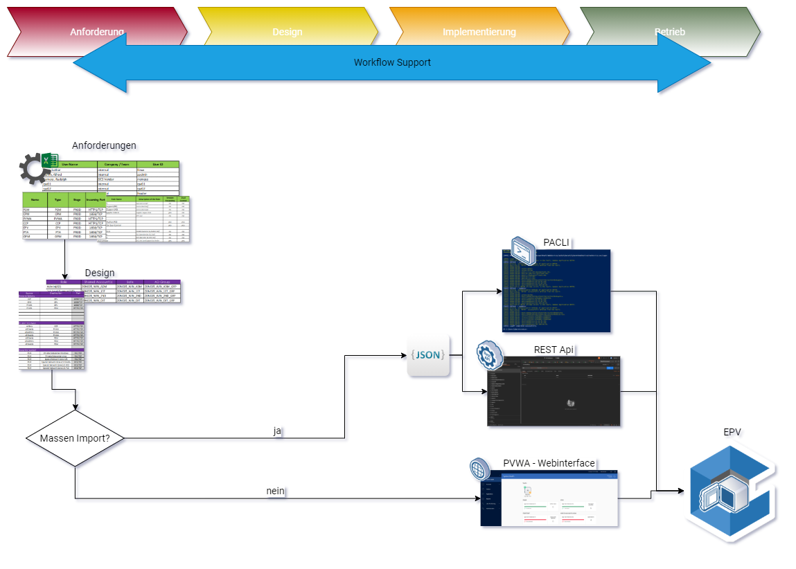
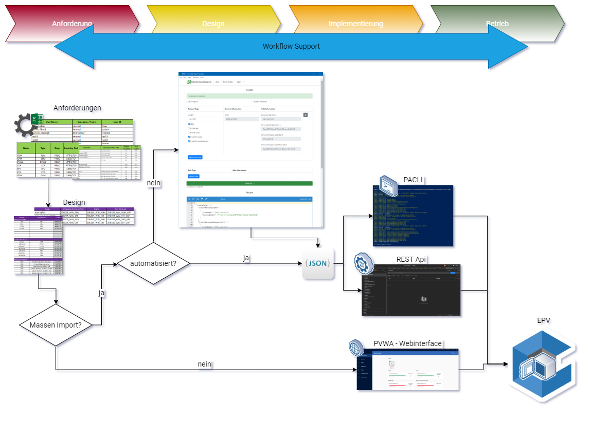

### CyberArk Data Tool

Entwicklung einer nativen, crossplattform GUI mit Web Technologien

<small>von [Achim Hilker](https://github.com/achimwork) / [PRO DV AG](https://prodv.de)</small>

---

## Übersicht

1.  Hintergrund
2.  Anforderungen
3.  Technolgische Auswahl
4.  Demo: Entwicklungsumgebung
5.  Demo: Das Ergebniss
6.  Zusammenfassung

---

### Problemstellung

--

### Lösung

---

### Anforderungen

--

### Anwender

intuitive Oberfläche
intuitive Bedienung
Hilfetexte

--

### Administrator

anpassbar und konfigurierbar
Eingabevalidierung

--

### Entwickler

Doumentation
Entwicklungsumgebung
automatisierte Kompilation

--

### Technologisch

zukunfstsichere Technologien
Plattformübergreifend
Open Source

---

## technolgische Auswahl

--

### Programiersprachen

|                                                                 |            |
| --------------------------------------------------------------- | ---------- |
| { height=150px}{.fragment .grow}   | HTML5      |
| { height=150px}{.fragment .grow}     | CSS3       |
| { width=150px}{.fragment .grow} | JavaScript |

--

### Bibliotheken

|                                                         |                                                  |
| ------------------------------------------------------- | ------------------------------------------------ |
| { width=150px}         | [node.js](https://nodejs.org/)                   |
| { width=150px}   | [electron.js](https://www.electronjs.org/)       |
| { width=150px}       | [formio.js](https://formio.github.io/formio.js/) |
| { width=150px} | [Semantic UI](https://semantic-ui.com/)          |

---

### Entwicklungsumgebung

Editor: Visual Studio Code (VSCode)

Source Controll System: Git

Paketmanager: NPM (Node.js)

--

### Datenverarbeitung

- CSV von Export
- Eingabe durch User
- REST Webservice

---

graph LR;
  A(AAAA)==> B(B node);
  B==> C(SEE SEE);

class A diag-a-styles;
class B diag-b-styles
class C diag-c-styles;

